# Linux_fundamentals
## Introduction

**Linux** is an open-source operating system based on Unix, widely used for its stability, security, and flexibility. It acts as a bridge between hardware and software, managing system resources and enabling users to run applications and perform tasks.

Unlike Windows or macOS, Linux offers a powerful command-line interface, making it a favorite for developers, system administrators, and cloud computing. It comes in many distributions (distros) like Ubuntu, CentOS, and Debian, and it's commonly used in servers, smartphones (like Android), embedded systems, and cloud platforms.

This project provides a hands-on introduction to Linux fundamentals. It focuses on the basics of navigating the Linux command line, managing files and directories, and working with essential system commands. It involves launching a virtual server (EC2 instance) on AWS, configuring it with a Linux-based operating system, and connecting to it remotely using SSH. By the end of this project, users will not only be comfortable with core Linux operations but also capable of deploying and managing a basic Linux server in the cloud.

## Details

1. ## Setting up a Linux Server

I signed into my AWS console and created an EC2 instance which I named Linux_server as can be seen in the screenshot below.

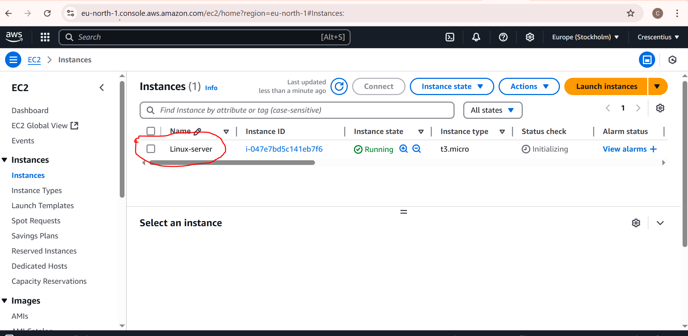

2. ## Installing a client tool

I visited https://mobaxterm.mobatek.net/ to download MobaXterm which is a cliebt tool.

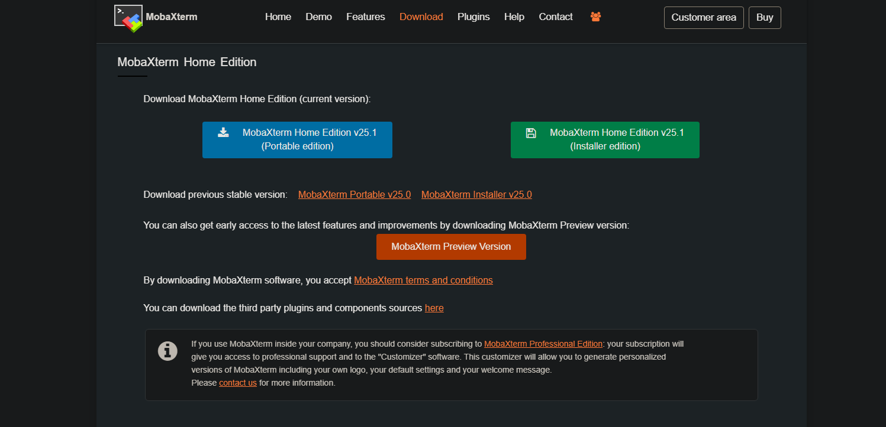

I installed MobaXterm

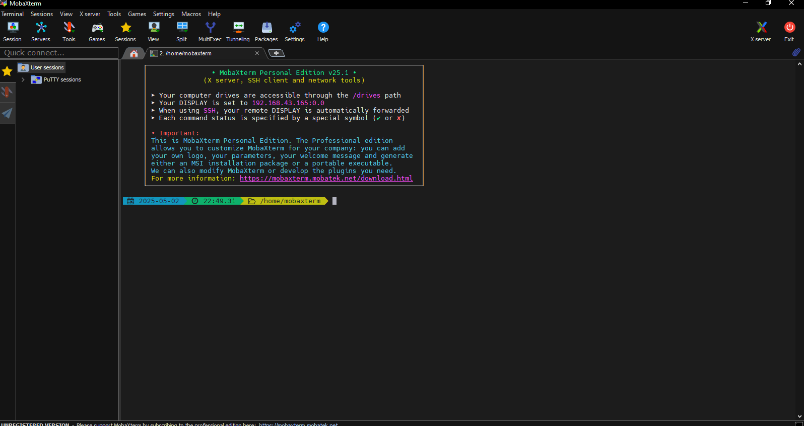

3. ## Connect the cloud server
I turned on the EC2 instance and connected it. I also downloaded the pem key which I named emeka_ec2.pem

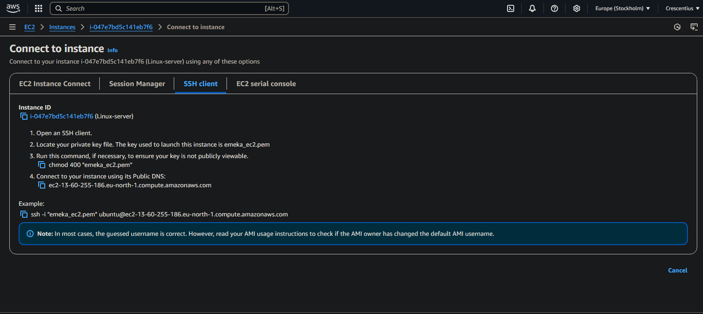

4. ## Connect using SSH
 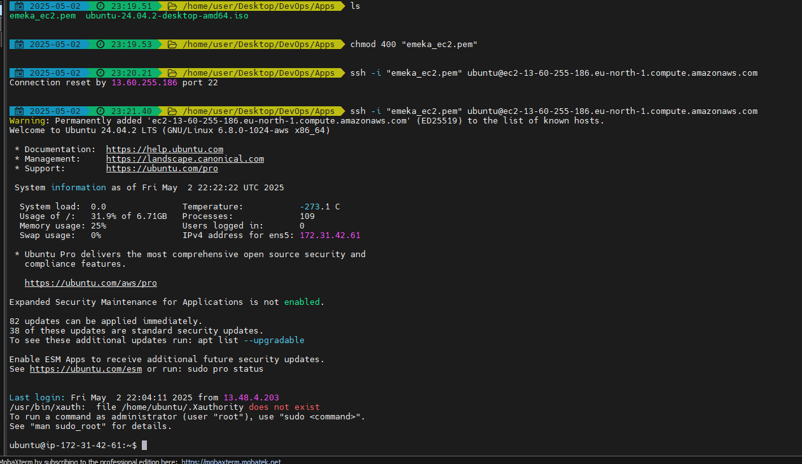

Using my pem key and server ip address, I ran the ssh command to connect to the server.

5. ## Refresh package list

I refreshed the package list using "sudo apt update" command.

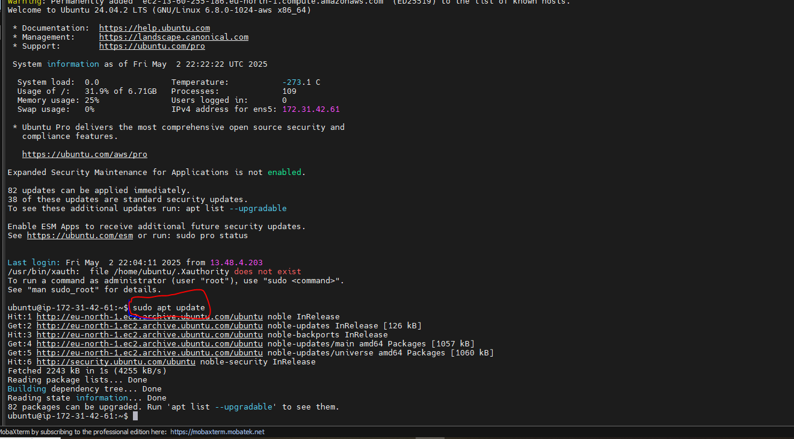

6. ## Install tree
Using "sudo apt install tree", I installed tree.

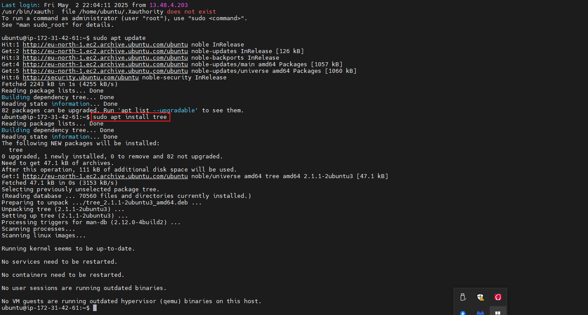

7. ## Verify tree
I verified the installed tree package by running "tree ~/new_folder"

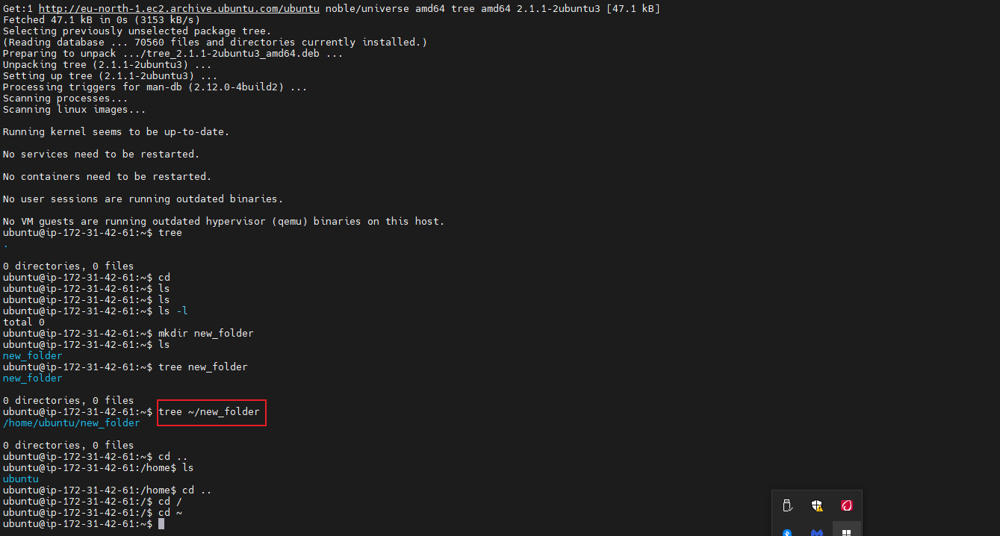

8. ## Update package

I ran the following command "sudo apt upgrade" to update the apt package

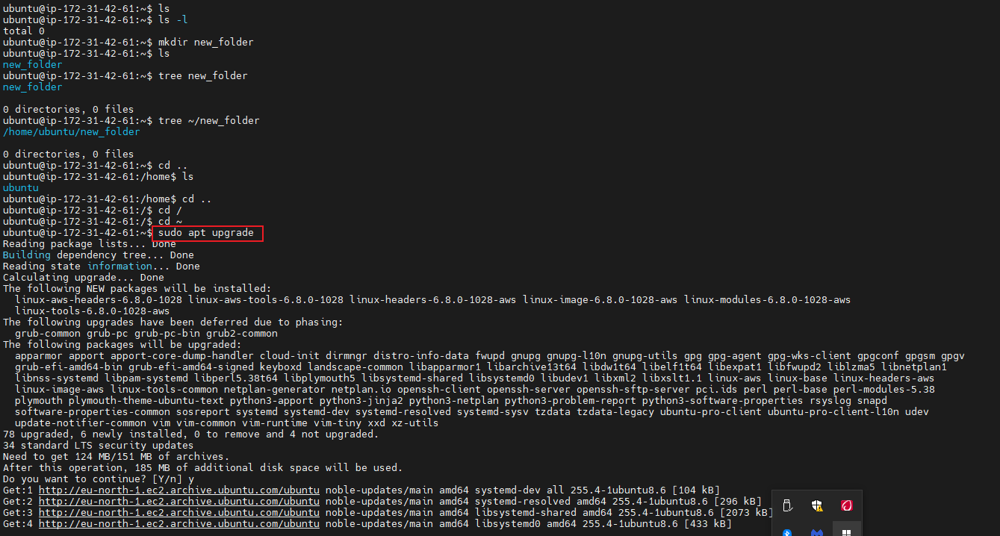

9. ## Remove a package

I removed the tree package using "sudo apt remove tree"

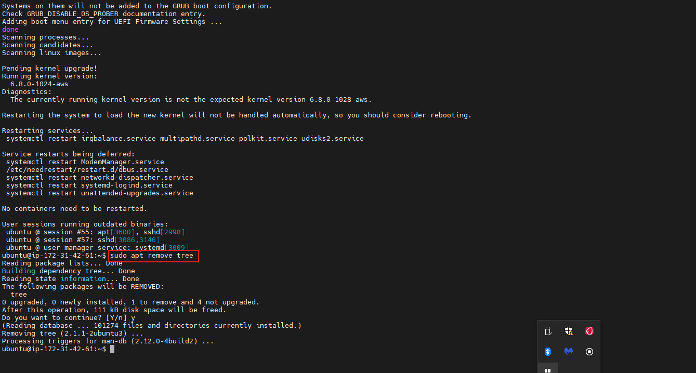

10. ## Install Nginx

I finally installed nginx using the following command "sudo apt install nginx"

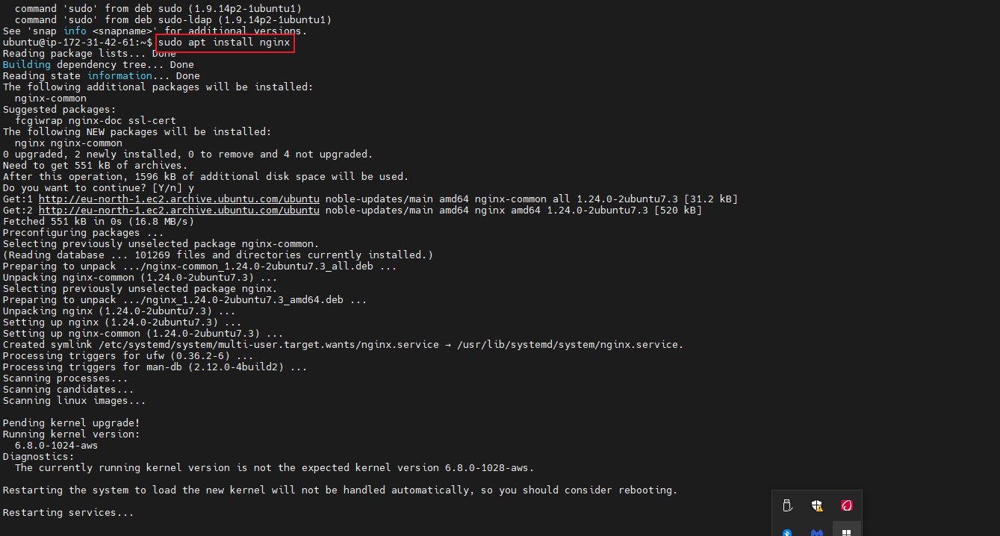